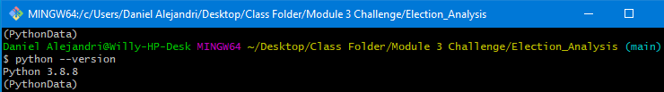

# Election Analysis

## Project Overview

A Colorado Board of Elections employee has provided the data required to perform the election audit of a recent local congressional election.

For this project we will use python base code to conduct the required analysis to calculate the following election results:

  1. Calculate the total number of **Total Votes**.
  2. Calculate the number of votes for each county and its percent of the total vote count.
  3. Largest County Turnout
  5. Get a complete list of candidates who received votes.
  6. Calculate the total number of votes each candidate received.
  7. Calculate the percentage of votes each candidate won.
  5. Determine the winner of the election based on popular vote by:  
> - Winning Vote Count
> - Winning Percentage
  
  
## Resources

**Data Source:**
A comma-separated values (CSV) file with header information: election_results.csv

**Software:** 
- Python 3.8.8

 
- Visual Code, 1.58.0

- Git for Windows v2.32.0

## Summary
The analysis of the election show that:

  - There were 369,711 total votes cast in the election.
  - The Largest County Turnout was Denver with 306,055 votes a 82.8% of the Total Votes.

  - The candidates were:
    - Candidate 1: Charles Casper Stockham
    - Candidate 2: Diana DeGette
    - Candidate 3: Raymon Anthony Doane

  - The candidate results were:
 
    - Charles Casper Stockham received 23.0% of the vote and 85,213 votes.
    - Diana DeGette received 73.8% of the vote and 272,892 votes.
    - Raymon Anthony Doane received 3.1% of the vote and 11,606 votes.
    
  - The winner of the election was:
    - **Diana DeGette, who received 73.8% of the vote and 272,892 votes.**

##  Election-Audit Summary: 
The python script that performs the analysis uses by default a source file named "election_results.csv" that is a csv file located under the Resources directory. The code 
has been updated to allow the user to specify an input option to select another csv file name within the same Resources directory.

A second option was added to read a csv file from a public url, however it is not completely functional and still being developed.

For debugging process I have created a public repository:
https://cvssample.s3.us-west-1.amazonaws.com/csvsample/election_results.csv
